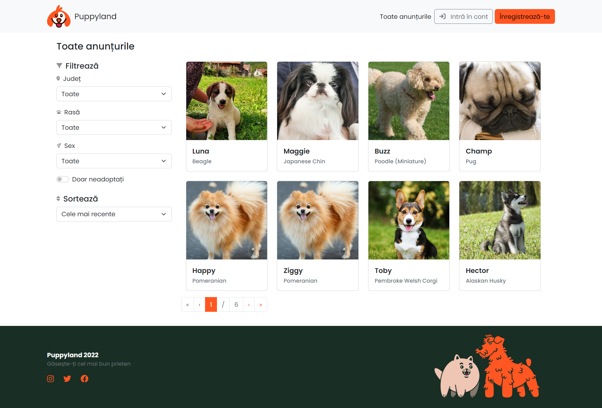

# Puppyland

### How to run

- `npm i --force` (we need to force as `@formkit/auto-animate` is not fully compatible with our version of React)
- `npm start` (to start the client)
- `node server` (in a different Terminal, to start the server)

### Screenshots

