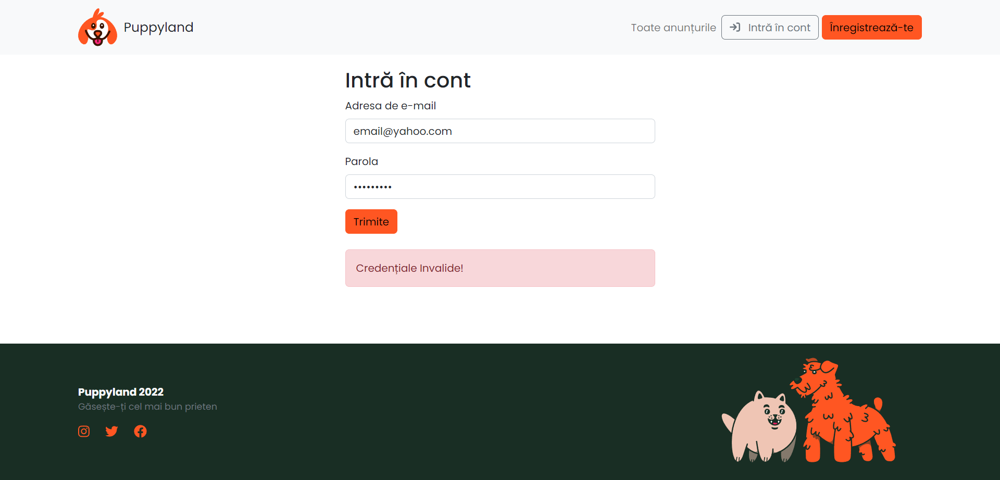
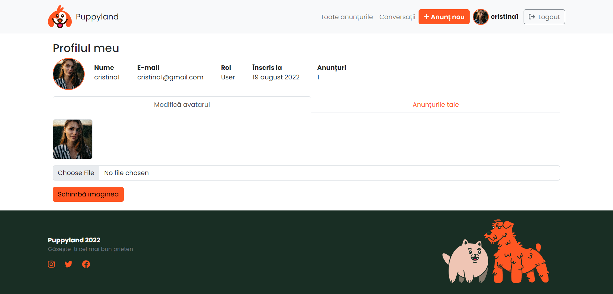
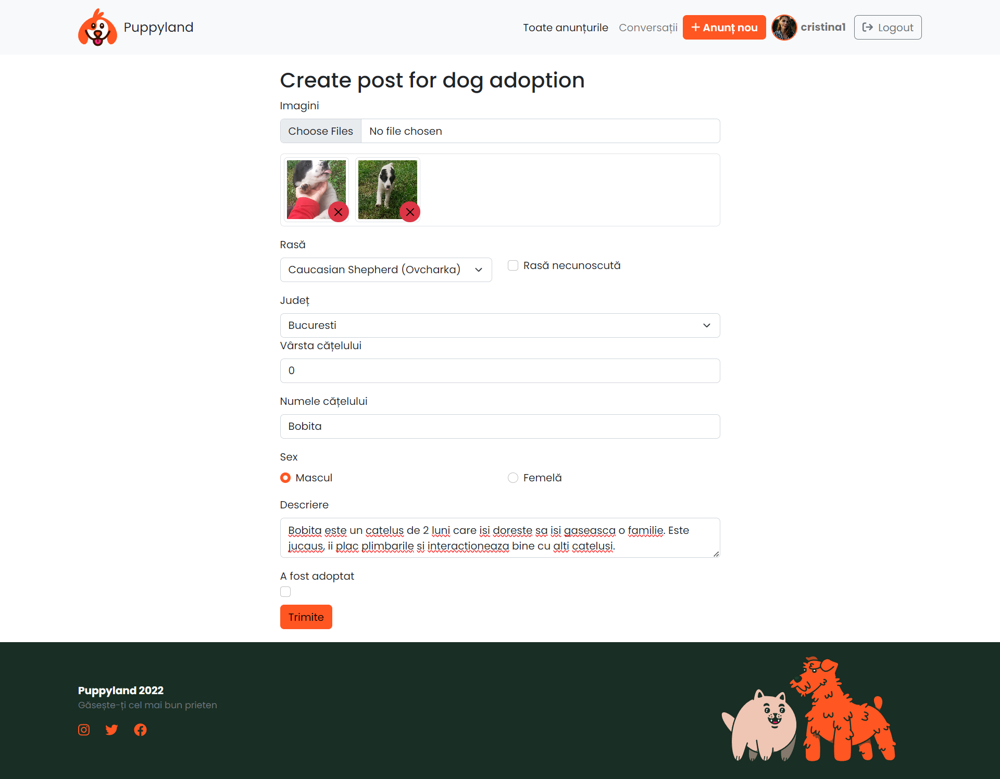
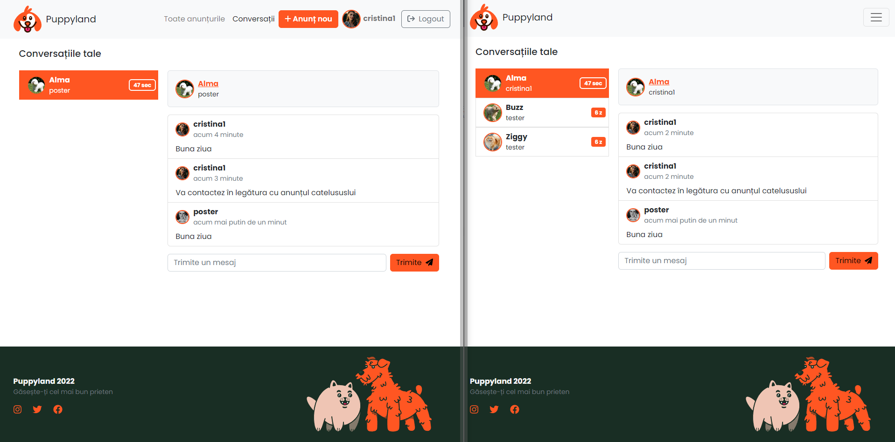
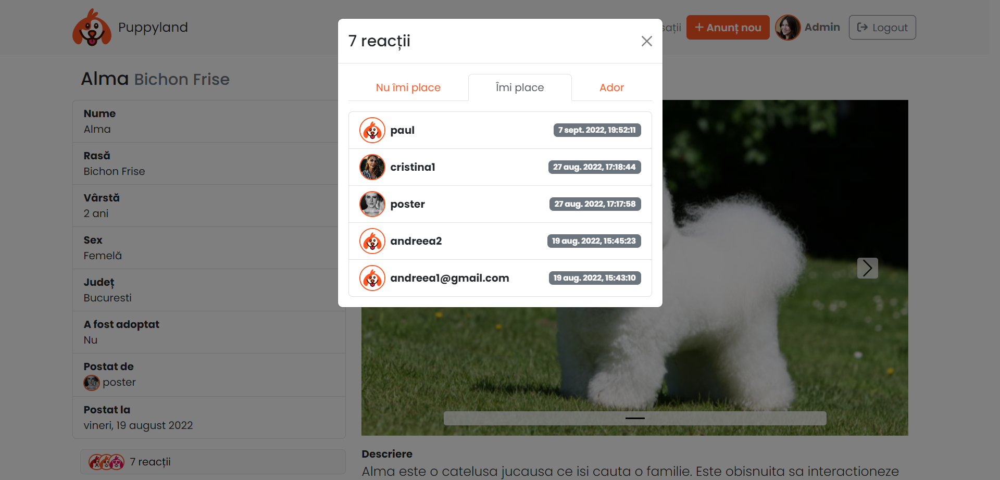
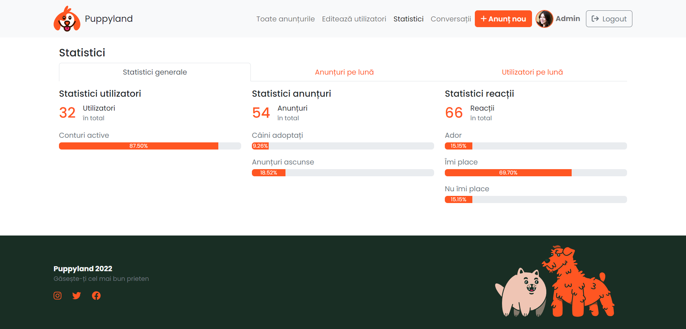

# Puppyland

#####Masters degree project

### How to run

- `npm i --force` (we need to force as `@formkit/auto-animate` is not fully compatible with our version of React)
- `npm start` (to start the client)
- `node server` (in a different Terminal, to start the server)

### Screenshots

_Home page_

_Register page_

_Login page_

_My profile page_

_Create post page_

_Chat page_

_Reactions to post page_

_Admin statistics page_

_Admin edit users page_
